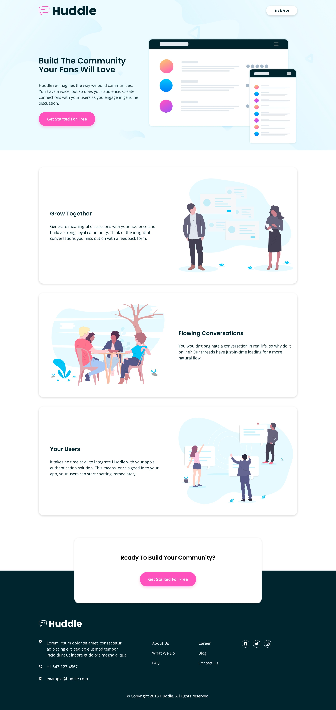
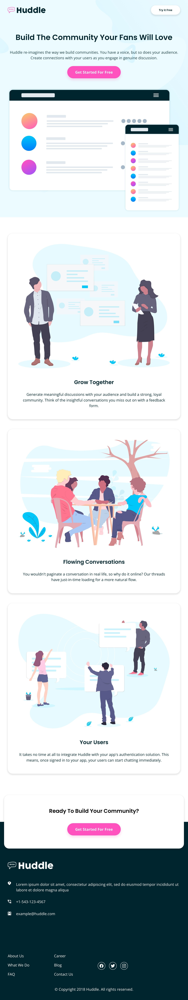
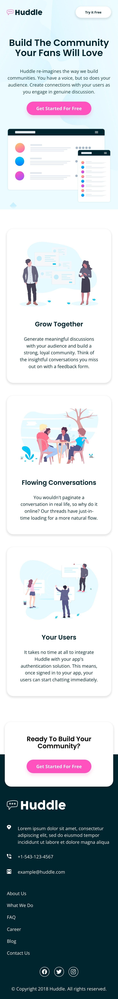

## Table of contents

- [Overview](#overview)
  - [The challenge](#the-challenge)
  - [Screenshot](#screenshot)
  - [Links](#links)
- [My process](#my-process)
  - [Built with](#built-with)
  - [What I learned](#what-i-learned)
  - [Continued development](#continued-development)
  - [Useful resources](#useful-resources)
- [Author](#author)

## Overview

### The challenge

The users will be able to:

- View the optimal layout for the site depending on their device's screen size.
- The hover states will be seen fro all interective elements on the page.

### Screenshot



_A screen shot showing the desktop view_



_A view of the landing page on a tablet_



_A view of the landing page on a mobile phone_

### Links

- Solution URL: [Add solution URL here](https://github.com/TraversetheDOM/Huddle-landing-page-alternating-features)
- Live Site URL: [Add live site URL here](https://TraversetheDOM.github.io/Huddle-landing-page-alternating-features/)

## My process

### Built with

- Semantic HTML5 markup
- CSS custom properties
- Flexbox
- Grid
- Mobile-First Workflow

**Note: These are just examples. Delete this note and replace the list above with your own choices**

### What I learned

Still worked on my use of flex box and css grid. I learnt how to make the underline animation on the links when the mouse is hovered over it as it's something I have never done before.

Here is a snippet on how I was able to solve the problem:

```css
.footer_link:is(:link, :visited) {
  color: var(--white);
  font-size: var(--fs-10);
  cursor: pointer;
  position: relative;
}

.footer_link::after {
  content: "";
  position: absolute;
  display: inline-block;
  background-color: var(--white);
  width: 0;
  height: 1px;
  left: 50%;
  bottom: -1px;
  transition: all 0.4s;
}

.footer_link:is(:hover, :active, :focus)::after {
  width: 50%;
}

.footer_link::before {
  content: "";
  position: absolute;
  display: inline-block;
  width: 0;
  right: 50%;
  bottom: -1px;
  height: 1px;
  transition: all 0.4s;
  background-color: var(--white);
}

.footer_link:is(:hover, :active, :focus)::before {
  width: 50%;
}
```

### Continued development

I would surely keep learning and improving on my use of flexbox and grid to make layouts and even more complex one as well. I would also need to get more comfortable with makimg the layouts much better with the use of media queries.

### Useful resources

- [w3schools](https://w3schools.com) - This webiste really helped when usig flexbox to structure the layout of the landing page.
- [MDN](https://developer.mozilla.org/en-US/docs/Learn/CSS/CSS_layout/Flexbox) - This site alos helped as well when I was working with flexbox and I highly recommend it as well.
- [CodingArtist](https://www.youtube.com/watch?v=aswRKAjjWuE) - This youtube channel was where I was able to learn how to make the underline hover effect.

## Author

- Twitter - [@\_salutDami](https://www.twitter.com/_salutDami)
- Linkedin- [Ikuomola Stephen](https://www.linkedin.com/in/ikuomola-stephen/)
- Frontend Mentor - [@salutDami](https://www.frontendmentor.io/profile/salutDami)
